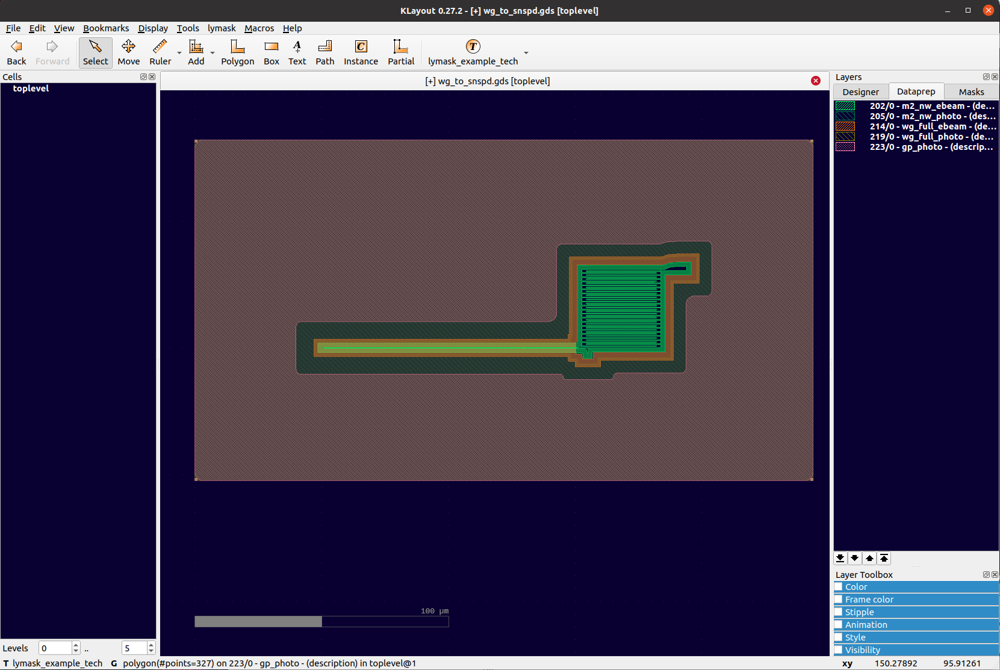

[](https://travis-ci.org/atait/lytest)

# lymask

Mask dataprep with python and klayout. Dataprep can mean almost any kind of batch process on layouts between the design phase and sending to lithography machine. `lymask` provides a simple, YAML-based specification of dataprep, entry points into klayout's multi-thread-able C++ engine, and common procedures such as bulk/sleeve split lithography processing.

Procedures are interpreted from YAML files which means they
- are easy to understand and edit
- can be modified without restarting klayout
- are declaritive, so their parameters can be accessed by other programs

Multiple entry points
- GUI menu: used for basic development and debug
- Command line: used for batch processing, particularly on remote computers
- API functions: used for automation within a larger program

## Installation
```
pip install lymask
lygadgets_link lymask
```

## Tutorial
### Downloading and linking a technology
Using NIST's superconducting optoelectronic neural networks technology. Start with
```bash
git clone git@github.com:usnistgov/SOEN-PDK
lygadgets_link SOEN-PDK/tech/OLMAC
```

We need a layout to test lymask functionality. To generate this, you will need phidl (`pip install phidl`). Go back to terminal, and
```bash
python SOEN-PDK/tech/OLMAC/xsect/example-xs.py
klayout example-xs.gds
```

klayout will open. In dropdown, select the "OLMAC" technology. Then, click the button that now says "OLMAC". In menu, click "lymask > Reload dataprep (Ctrl + L)". You should see a number of layers on the right side window.

### X sections
This generated layout is meant to feature X-section behavior. You can install "xsection" through klayout's salt manager, which will give additional commands for the GUI. Draw a ruler across the whole layout, and then press "Tools > XSection 1.4 Scripts > XSection: Current Technology (Shift + Ctrl + X)".

### Dataprep processing


Open another layout
```bash
klayout SOEN-PDK/tech/OLMAC/olmac_pcells/ref_layouts/wg_to_snspd.gds
```
"lymask > Mask dataprep > Run default.yml" will generate masks that will be fed to the EBeam writer. The layers are grouped in other tabs of the layout window. Some of the geometries are offset. Some are inverted. This also demonstrates bulk-sleeve behavior for split-step lithography. Find "default.yml" for an example of specifying dataprep.

Bug: Sometimes the layer list does not update with the layer group tab. Double click a polygon to make it refresh.

### Paper quality figures
In klayout, "File > Load Layer Properties". Navigate to "camera_ready_OLMAC.lyp" and select. Finally, go to "File > Setup > Display > Background" and choose a white layout. You can also increase the oversampling. Now you can put the layout into nice presentations and papers.

### DRC
klayout GUI can run macro DRC of the form ".lydrc", but these are in ruby and are difficult to access parameters from outside. `lymask` uses YAML specification and python layout scripting.

DRC is currently not working because of empty layer bug.

### Clean up
To remove OLMAC, 
```bash
lygadgets_unlink OLMAC
rm -rf SOEN-PDK
rm example-xs.gds
```

And uninstall phidl too if desired.


## Commands
See the tests for usage examples.

_Dataprep_
- check_floorplan
- flatten
- erase_text_and_other_junk
- convert_wgs
- nanowire_heal
- processor
- nanowire_sleeve
- waveguide_sleeve
- ground_plane
- metal_pedestal
- precomp
- mask_map
- smooth_floating
- clear_nonmask
- align_corners

_DRC_
- make_rdbcells
- processor
- drcX
- width
- space
- inclusion
- exclusion


## Configuring a technology
KLayout-style technologies are directories that include a `.lyt` file and usually a layer properties `.lyp` file. `lymask` looks for available scripts in specific locations within "dataprep" and "drc" subdirectories. The structure should look like this
```
My_Tech
| - My_Tech.lyt
| - klayout_layers_My_Tech.lyp
| - dataprep
| | - my_dataprep_procedure.yml
| | - klayout_layers_dataprep.lyp
| - drc
| | - my_drc_procedure.yml
```
`klayout_layers_dataprep.lyp` can have multiple groups. See the tests for an example. In the GUI, `lymask` translates these groups into layer tabs for ease of viewing. This is done with "Reload Dataprep (Ctrl-L)" in the `lymask` menu.


## DRC todo
- Handle empty layers
XX - batch launching
XX - output to lyrdb files
XX - command line reorganization
XX - tests: generate the files and compare as xmldicts
XX - angle limits
- tiling
XX - drc exclude
- falling back on designer layers?
XX - inclusion, exclusion
- self overlap
- minimum area
- edge lengths
- run other files
XX - define your own in your dataprep directory

## Multithreading experiments
Data from doing a DRC space_check Vs number of tiles. A 6 mm x 7.75 mm die. 500nm space check on a fairly full layer (metal with ground plane). Tile border is 1000nm.  Machine was a 4-core laptop. Thread count = 4.

Tile border = 1000 nm
- 1: 108 sec
- 2x2: 41 sec
- 3x3: 94 sec
- 4x4: 82 sec
- 10x10: 215 sec

Tile border = 550 nm
- 2x2: 35 sec (repeated twice, same value)
- 3x3: 37 sec
- 4x4: 57 sec
- 8x8: 59 sec
- 1x4: 56 sec
- 1x16: 62 sec

With angle 40 (gives no violations. other one gave 140 violations)
- 2x2: 17 sec (repeated thrice)
- 2x2 with violation: 26 sec (error was appropriately caught)
- 3x3: 18 sec

No tile border
- 2x2: 28 sec
- 3x3: 16 sec
- 3x3, 12 threads: 15 sec
- 8x8: 14 sec
- 16x16: 16 sec
